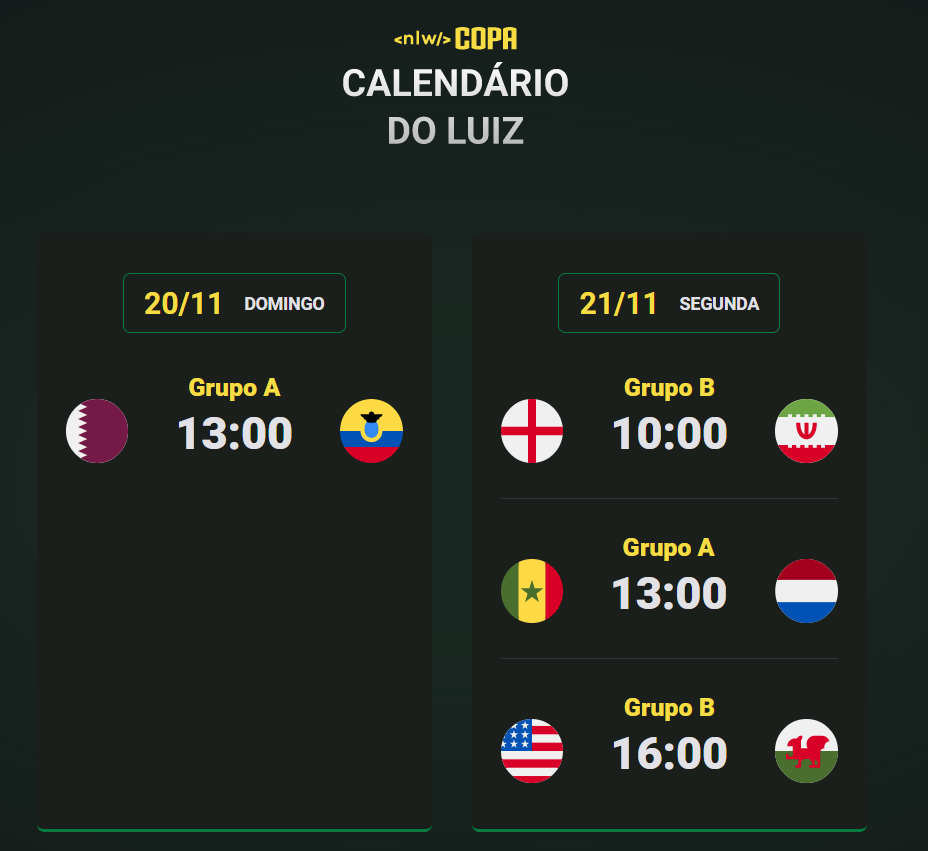

<h1 align="center">World Cup Calendar - NLW 10</h1>

2022 World Cup Calendar, developed during Rocketseat's NLW event, with some modifications made by me.

  <a href="#-tecnologias">Tecnologies</a>&nbsp;&nbsp;&nbsp;|&nbsp;&nbsp;&nbsp;
  <a href="#-projeto">Project</a>&nbsp;&nbsp;&nbsp;|&nbsp;&nbsp;&nbsp;
  <a href="#-layout">Layout</a>&nbsp;&nbsp;&nbsp;|&nbsp;&nbsp;&nbsp;
  <a href="#memo-licença">License</a>

  

 

  

 

## 🚀 Tecnologies

This project was developed with the following technologies:

- HTML e CSS
- JavaScript 

 

## 💻 Project

The 2022 World Cup calendar aims to list the group stage matches of the event, with information on time, day, and teams that will participate in each match. 

 

## 🔖 Layout

You can view the project layout through [THIS LINK](https://www.figma.com/community/file/1169028052212317700). You must have an account in [Figma](https://figma.com) to access it.

 

## :memo: Licença

This project is under the MIT license.

---

Made with ♥ by Luiz Alexandre